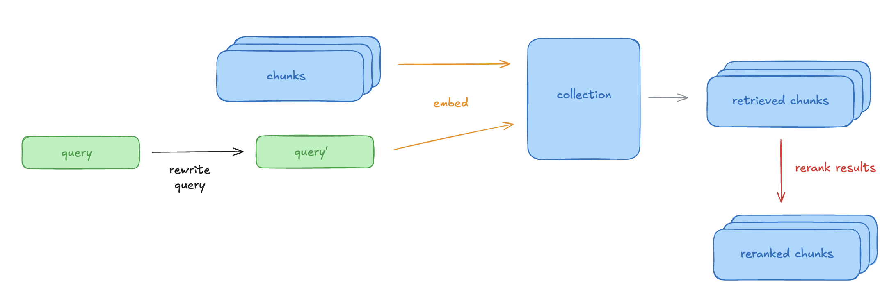

# Experimentation Playground

Eval harness for iterating on single-stage retrieval.

Latest update on 12-23-2025

## Overview



This playground breaks retrieval into three components:
1. **Embedding** (i.e. dense, sparse)
2. **Pre-retrieval processing** (i.e. query expansion)
3. **Post-retrieval processing** (i.e. reranking via Voyage AI reranker)

Each component uses a simple registry pattern. To add a new implementation, just implement the interface and register it. Run experiments via config files.

## Quickstart

### Setup

Install dependencies:
```bash
uv sync
```

Download sample data:
```bash
./download_sample_data.sh
```

Define environment variables in `.env`:
- `OPENAI_API_KEY`
- `CHROMA_API_KEY`
- `CHROMA_TENANT`
- `CHROMA_DATABASE`
- `VOYAGE_API_KEY` (if using Voyage reranking)
- `CONTEXTUAL_API_KEY` (if using Contextual reranking)

### Usage

**Run a single experiment:**
```bash
run single \
  --run-id openai-small \
  --embed-method dense:openai:text-embedding-3-small \
  --collection dense-openai-small \
  --data-dir data/experimentation-playground-sample-data
```

**With query rewriting:**
```bash
run single \
  --run-id openai-small-rewrite \
  --embed-method dense:openai:text-embedding-3-small \
  --rewrite-method expand:openai:gpt-4.1-nano \
  --collection dense-openai-small \
  --data-dir data/experimentation-playground-sample-data
```

**With reranking:**
```bash
run single \
  --run-id openai-small-rerank \
  --embed-method dense:openai:text-embedding-3-small \
  --rerank-method voyage:rerank-2.5 \
  --collection dense-openai-small \
  --data-dir data/experimentation-playground-sample-data
```

**Query rewriting + reranking:**
```bash
run single \
  --run-id openai-small-rewrite-rerank \
  --embed-method dense:openai:text-embedding-3-small \
  --rewrite-method expand:openai:gpt-4.1-nano \
  --rerank-method voyage:rerank-2.5 \
  --collection dense-openai-small \
  --data-dir data/experimentation-playground-sample-data
```

**Run a sweep:**
```bash
run sweep --config configs/sample_sweep.json
```

Results are saved to:
- Single runs: `results/{run-id}.json`
- Sweeps: `{output_dir}/{run-id}.json` (configured in sweep JSON)

## Architecture

### Components

**Embedding (required):**
- `dense:openai:text-embedding-3-small`
- `dense:openai:text-embedding-3-large`
- `sparse` (uses Chroma Cloud SPLADE)

**Query Rewriting (optional):**
- `expand:{provider}:{model}` - Expands query for better recall

**Reranking (optional):**
- `voyage:{model}` - Voyage AI reranking
- `contextual:{model}` - Contextual AI reranking

### Sweep Configuration

```json
{
  "data_dir": "data/experimentation-playground-sample-data",
  "output_dir": "results/my_sweep",
  "runs": [
    {
      "run_id": "baseline",
      "embed_method": "dense:openai:text-embedding-3-small",
      "collection": "corpus-1"
    },
    {
      "run_id": "with-rerank",
      "embed_method": "dense:openai:text-embedding-3-small",
      "rerank_method": "voyage:rerank-2.5",
      "collection": "corpus-1" # since we are using the same embedding method
    }
  ]
}
```